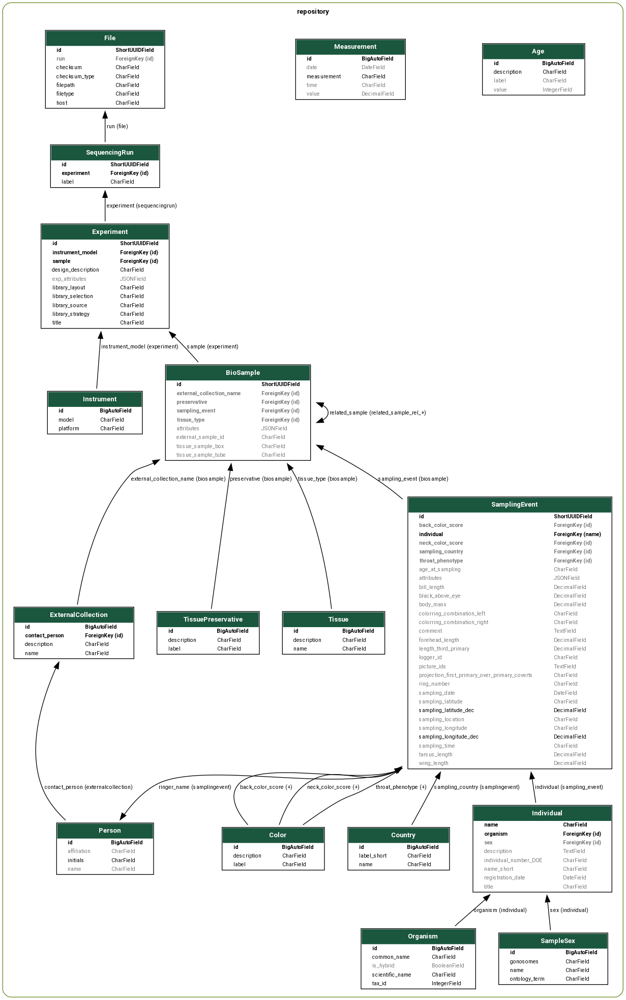

# sampledb

[](https://github.com/fritjoflammers/sampledb-public/actions/workflows/main.yml)

This is a alpha-stage Django application to store metadata of biological samples and associated high-throughput sequencing datasets. 


## Data Model




## How to run


## Build Docker image

```bash

docker build -t sampledb .

```

## Run container

```bash

MYSECRETKEY="mysecretkey"

docker run -it -p 8020:8010 -e SECRET_KEY="$MYSECRETKEY" -v $(pwd):/opt/app/ sampledb:test
```

## Using conda

Alternatively, you can also create a conda/mamba environment using `environment.yml` file, activate it and start `start-server.sh`.

## Deployment 

Production deployment is done on heroku using a *basic* dyno with a *Mini* Postgres database. 

The heroku setup was done as follows:

```bash
heroku stack:set heroku-22
heroku config:set DISABLE_COLLECTSTATIC=1

heroku config:set DJANGO_SETTINGS_MODULE=sampledb.settings.production


# set dyno
heroku ps:resize web=basic

# set domain

heroku domains:add $MYDOMAIN
heroku certs:auto
heroku config:set DJANGO_ALLOWED_HOSTS=$MYDOMAIN

# activate postgres
heroku addons:create heroku-postgresql
```

Django settings for deployment are defined in `sampledb/settings/production.py` and imported by setting the 
environment variable via

### Populate PostgresSQL on Heroku

Create a local PostgresSQL server, initiate tables/app and import data. 
Then, create a database dump using `pg_dump` and push to Heroku. 

Alternatively, push from local DB dirgit push --set-upstream origin devectly to Heroku. 

```bash
 heroku pg:push local database:PGUSER=sampledb PGPASSWORD=sampledb@postgres  sampledb pg:push $POSTGRES_URI $POSTGRES_DB_NAME
 pg_dump --user sampledb postgres://localhost > pg_dump.sql
 PGUSER=sampledb PGPASSWORD="sampledb@postgres" && heroku pg:push postgres://localhost/sampledb $POSTGRES_DB_NAME --app sampledb
 
```

### Applying migration on Heroku

Applying database migrations on the Heroku production database 